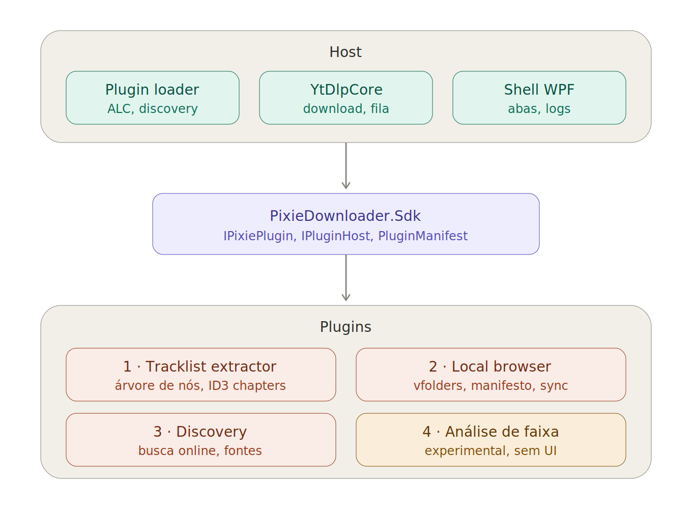

# PixieDownloader — arquitetura de plugins e roadmap 1.5 → 1.8



## Princípio

O app não deve crescer virando bloatware. Funcionalidade além do download vive
em plugins carregados em runtime, cada um instalável e desativável sozinho.

**Nenhum plugin conhece outro plugin.** Toda comunicação passa pelo host, via
`PixieDownloader.Sdk`. Isso mantém cada módulo como uma ilha, e um módulo
desligado não afeta nada do resto.

---

## PixieDownloader.Sdk

Assembly separado, sem dependências externas, com versão própria (`apiVersion`)
independente da versão do app.

Ele existe separado porque o mesmo tipo precisa ser visível dos dois lados da
fronteira do `AssemblyLoadContext`. Se as interfaces morarem no exe do host, o
plugin passa a depender do exe inteiro e a resolução de tipo fica frágil.

Ele referencia o `YtDlpCore`: `IPluginHost` entrega `IYtDlpService`, que mora
lá. A API de plugin é, portanto, o Sdk **mais os tipos públicos do core**, e o
`apiVersion` cobre os dois. Fachadas próprias no Sdk são o escape se essa
exposição doer um dia — não valem o custo agora.

Alvo `net10.0-windows` com WPF, para `IUiContribution` devolver
`FrameworkElement` tipado em vez de `object`. Consequência: o projeto de testes
do core (`net10.0`) não consegue referenciá-lo; a prova de carga via ALC vive
num projeto de testes próprio, `net10.0-windows`.

Conteúdo mínimo:

- `IPixiePlugin` — `Configure(IPluginHost)`
- `IPluginHost` — serviços do host (`IYtDlpService`, log, pasta de dados,
  token de cancelamento), o manifesto do próprio plugin, registro de capacidades
- `PluginManifest` — id, nome, versão, `apiVersion`, `dependsOn`
- `IUiContribution` — separado de `IPixiePlugin`, porque nem todo plugin tem aba

### Carregamento

```csharp
class PluginLoadContext : AssemblyLoadContext {
    // Tudo que host e plugin precisam enxergar como o MESMO tipo: o Sdk e o core.
    // Os nomes saem dos tipos, não de strings — renomear um assembly não quebra calado.
    static readonly HashSet<string> Shared = [
        typeof(IPixiePlugin).Assembly.GetName().Name!,
        typeof(IYtDlpService).Assembly.GetName().Name!,
    ];
    readonly AssemblyDependencyResolver _r;
    public PluginLoadContext(string path) : base(isCollectible: true)
        => _r = new AssemblyDependencyResolver(path);

    protected override Assembly? Load(AssemblyName n) {
        if (Shared.Contains(n.Name!)) return null;
        var p = _r.ResolveAssemblyToPath(n);
        return p is null ? null : LoadFromAssemblyPath(p);
    }
}
```

Retornar `null` para os assemblies compartilhados é o que força a resolução
pelo Default ALC. Sem isso, o `IPixiePlugin` do plugin e o do host viram tipos
distintos e o cast falha com uma mensagem impossível de ler. O `YtDlpCore`
entra no conjunto pelo mesmo motivo: `IYtDlpService` do plugin e do host
precisam ser um tipo só.

O plugin referencia os dois sem copiá-los para a própria pasta — dentro do repo
via `ProjectReference` com `Private="false"` e `ExcludeAssets="runtime"`; de
fora, via o pacote (abaixo) com `ExcludeAssets="runtime"`. Nos dois casos,
`EnableDynamicLoading=true` no csproj do plugin. Se uma cópia vazar mesmo
assim, o loader ignora pelo nome.

### Distribuição

O host carrega o Sdk de dentro do próprio exe (publish single-file), nunca de
um DLL solto ao lado. Um DLL solto cria o cenário "atualizou só o exe, ficou o
Sdk velho": como o host *implementa* `IPluginHost`, uma interface sem o membro
novo derruba a classe do host no `TypeLoadException` — o app não abre.

Quem escreve plugin fora do repo referencia o **`PixieDownloader.Sdk.nupkg`**:
um pacote só, com o `YtDlpCore.dll` dentro (o core faz parte da API, e dois
pacotes seriam duas versões para acompanhar). A versão do pacote **é** o
`apiVersion`, então "qual API esse exe carrega" e "qual pacote eu referencio"
são o mesmo número. O `release.ps1` gera o `.nupkg` e ele entra como asset da
GitHub Release ao lado dos zips; consumir de lá é `dotnet nuget add source`.
Publicar no nuget.org é uma linha a mais quando aparecer autor de fora — o id
é permanente, então `PixieDownloader.Sdk` fica fixado desde já.

### Descoberta

`plugins/<id>/plugin.json` — o manifesto é lido sem carregar assembly nenhum.
Isso permite listar plugins desabilitados na aba de plugins, e recusar
`apiVersion` incompatível antes de tocar em código.

### Habilitar / desabilitar / desinstalar

Unload real não funciona na prática em WPF: `DependencyProperty` registra
globalmente no processo e não tem API para desfazer. `ResourceDictionary`
merjado e `DataTemplate` cacheado agravam. O ALC fica colecionável mesmo assim,
mas não se promete hot reload.

- **Desabilitar** — efeito imediato: remove a aba, cancela o `CancellationToken`
  do plugin, marca a flag. A memória continua ocupada; ninguém percebe.
- **Desinstalar** — efeito no próximo start. O arquivo fica em lock até o
  processo morrer, então a pasta é apagada na varredura seguinte.

Dizer isso literalmente na UI evita confusão: "Desabilitar" sem aviso,
"Desinstalar" com "será removido ao reiniciar".

### Registro de capacidades

```csharp
IDisposable RegisterCapability(string id, Delegate impl);
bool TryGetCapability(string id, out Delegate impl);
```

Sem consumidor hoje. A assinatura entra na 1.5 porque adicionar método a
interface pública depois é bump de `apiVersion`. O `IDisposable` é o que permite
desregistrar ao desabilitar — capacidade é o único ponto onde um plugin
desligado ainda poderia ser alcançado. `TryGetCapability` retornando `false` é
caminho normal, não exceção.

---

## Módulo 1 — Tracklist extractor

Ordem de busca: descrição → comentário fixado → comentário mais curtido
(20 primeiros) → chapters como fallback.

### Modelo de dados

Nó e playlist são **o mesmo tipo**. Uma playlist é um nó com `children`
preenchido. Não há caso especial para o nível raiz, e a mesma renderização
e serialização funcionam em qualquer profundidade.

```jsonc
{
  "payloadVersion": 1,
  "source": "description",
  "root": {
    "title": "Mega mix vol. 3",
    "kind": "playlist",
    "url": "https://youtube.com/watch?v=...",
    "state": "resolved",
    "children": [
      {
        "title": "Faixa um",
        "kind": "track",
        "timestampMs": 0,
        "state": "empty",
        "children": []
      },
      {
        "title": "Outro mega mix",
        "kind": "playlist",
        "timestampMs": 432000,
        "url": "https://youtube.com/watch?v=...",
        "state": "unresolved",
        // TracklistNode[] — mesmo tipo do root, recursivo sem limite
        "children": []
      }
    ]
  }
}
```

`children` é **sempre array**, nunca null e nunca string. O estado mora em
`state`, campo separado, sempre string. Assim o tipo de cada campo nunca muda
e quem itera `children` itera sempre — num nó não resolvido a iteração
simplesmente não roda.

Estados: `unresolved` (nunca expandido), `resolved` (tem faixas), `empty`
(expandiu, não achou), `failed` (com campo `error` junto). `empty` merece ser
estado próprio porque é o caso comum, e difere de `failed` na ação sugerida —
`failed` por rate limit vale retry, `empty` não.

**Não usar nó sentinela dentro de `children` para marcar estado.** Isso faria
`children.length` mentir, obrigaria a filtrar antes de contar em todo ponto de
consumo, e o sentinela teria `children` próprio precisando de estado — recursão
sem fundo.

`payloadVersion` é da tracklist, não do app. É o que permite interpretar um MP3
taggeado seis meses atrás.

### Gravação nos metadados

**Não é preciso inventar formato binário.** ID3v2 tem `CHAP` e `CTOC` — frames
de capítulo com start/end em ms, título e URL opcional. É o que podcast usa.
MP4/M4A tem chapter atoms equivalentes. VLC, foobar2000 e mpv já leem.

Para a árvore completa, `TXXX:PIXIE_TRACKLIST` aceita payload de tamanho
arbitrário (o tag é size-prefixed). Grava-se o JSON ali e os `CHAP` em paralelo:
interoperável para todo mundo, completo para o Pixie.

### UI — árvore de nós

- **O bloco carrega a proveniência, não o item.** Quantos itens casaram, qual
  padrão pegou, e as fontes alternativas como segmentos no topo do bloco.
  Trocar de fonte troca o bloco inteiro, nunca item a item.
- **A contagem na alternativa é o sinal decisivo.** "Descrição 24 / Fixado 18 /
  Chapters 0" já diz qual usar antes de abrir.
- **Expansão é lazy e marcada visualmente.** Só busca no clique. Limite de
  profundidade configurável e detecção de ciclo — mega playlist linkando mega
  playlist acontece.
- **Itens problemáticos ficam na lista.** Tracklist parcial marcada como
  parcial; item sem título com warning. Esconder faz o usuário achar que
  extraiu certo.

---

## Módulo 2 — Music local browser

Catálogo do que já existe em disco. Virtual folders apontando para pastas
reais. Sem player embutido — abre no programa externo configurado (VLC
recomendado).

### Máquina de estados

Manifesto em JSON (legibilidade humana importa aqui; é configuração).

```
manifesto não existe     -> plugin não instalado, nada acontece
status = disabled        -> nada
status = synced          -> nada
status = sync pending    -> ao abrir a aba, sync incremental
status = sync ongoing    -> índice inconsistente, não confiar
```

`sync ongoing` significa "índice inconsistente", **não** "arquivo em lock". O
lock real dura milissegundos por escrita; o estado dura a varredura.

First init cria o JSON só com a flag, em `sync pending` — senão a primeira
abertura mostra catálogo vazio.

Download concluído flipa `synced` → `sync pending`. Escrita por
write-temp-and-rename: atômico no NTFS, e o pior caso é flip perdido em vez de
manifesto corrompido.

Volta de `synced` para `sync pending` também acontece por `mtime` das raízes,
comparado na abertura da aba. Custa um `stat` por raiz e cobre alteração de
pasta por fora.

O sync só grava `synced` se a flag ainda estiver no valor que ele leu ao
começar — compare-and-swap. Senão um download concluído no meio da varredura
seria sobrescrito.

`sync failed` fica reservado para varredura interrompida com índice pela
metade: aí a aba força varredura completa em vez de incremental.

### Cache de downloads

O downloader empilha o que baixou. É bloco, não stream — existe inteiro ou não
existe, e a interrupção despeja por completo. Não há estado parcial.

- Bloco carrega a data de criação, para saber se é anterior ao último sync.
- Incorporação é tudo-ou-nada: escreve índice, renomeia, **depois** apaga o
  bloco. Ordem inversa perde os itens se a escrita falhar.
- Incorporar duas vezes é inofensivo — o sync já deduplica.
- Desinstalar o módulo apaga blocos órfãos.

O cache é **otimização, não fonte de verdade**. Perdê-lo num crash só faz o
sync seguinte varrer um pouco mais. O `mtime` é a rede de segurança real.

### Identidade de arquivo

`(caminho, tamanho, mtime)` resolve quase tudo por `stat` puro. SHA completo de
áudio é caro num catálogo grande — guardar como campo opcional, preenchido sob
demanda. Hash parcial (primeiros e últimos 64KB + tamanho) é alternativa de
custo constante.

Índice separado do manifesto: manifesto é config legível, índice é dados. Se
JSON, escrever uma vez no fim do sync, não por item.

### Sync

- Não bloqueia a abertura da aba. Mostra o índice anterior e sincroniza atrás.
- Incremental por `mtime` de diretório — só lê tags onde mudou.
- Um único sync por vez; aba que abre no meio se anexa ao que está rodando.
- Processa o cache antes de varrer, para o recém-baixado aparecer primeiro.

---

## Módulo 3 — Discovery (1.8)

Busca online: YouTube, SoundCloud, Spotify (só para sinalizar que existe),
fontes obscuras. Direção oposta ao módulo 2 — não lê dele.

Cada fonte como sub-plugin, senão uma fonte quebrada derruba a aba inteira.

Cruzamento opcional com o módulo 2 (marcar o que já se tem) via arquivo de
índice em `Data/`, não via API. Nenhum dos dois precisa do outro carregado.

## Módulo 4 — Análise de faixa (v1.x, menção honrosa)

Sem UI. Identificar se a faixa encontrada é a mesma, se é remix, e analisar
crossfade. Score, nunca booleano — remix legítimo e reupload com pitch de 1%
são a mesma distância em métrica ingênua.

Contexto: as playlists têm crossfade (silencedetect não serve) e muito remix de
remix (MusicBrainz e AcoustID não ajudam). Sobra novelty detection em
espectrograma — não precisa saber *que* faixa é, só *onde* muda. A contagem de
faixas da tracklist vira restrição forte: escolher os N-1 melhores candidatos.

**Status: não há noção de como ele operaria.** Fica registrado como v1.x — uma
direção, não um plano. Só ganha número quando houver um protótipo que prove que
a detecção funciona nas playlists reais, não em áudio de teste limpo.

---

## Roadmap

### 1.5 — SDK

Escopo: o contrato existe e é provado. Nenhum módulo real.

1. `PixieDownloader.Sdk` com os quatro tipos, `RegisterCapability` já na
   assinatura, empacotado como `.nupkg` pelo `release.ps1`
2. `PluginLoadContext` com `AssemblyDependencyResolver`
3. Discovery por `plugin.json` + checagem de `apiVersion` com recusa clara nos logs
4. Plugin de teste que abre uma aba boba e chama `IYtDlpService`, mais um teste
   automatizado que o carrega pelo ALC e prova que o cast para `IPixiePlugin`
   funciona
5. Aba de plugins: id, versão, status, desabilitar, desinstalar

**Critério de saída:** o plugin de teste liga, desliga e desinstala sem tocar em
código do host.

O passo 4 é tentador de pular e é o que mais economiza — o problema de tipo
duplicado no ALC aparece lá, com dez linhas, em vez de no meio do extractor.
Por isso vem antes da aba, que é só UI.

### 1.6 — extractor plugado

1. Porta o extractor monolítico como plugin, lógica atual intacta
2. `TracklistNode` recursivo desde já, profundidade travada em 1
3. UI de blocos com fontes alternativas e contagem
4. Gravação de `CHAP`/`CTOC` no download
5. Módulo 2 com a máquina de estados e o cache em bloco

O passo 2 é o que faz a 1.7 ser barata. Se `children` nascer plano, a 1.7 vira
migração de dados em vez de feature.

### 1.7 — aninhamento

1. Destrava a profundidade
2. Expansão lazy com detecção de ciclo
3. `failed` com motivo e retry seletivo

O formato não muda — é só UI e loader de camada.

### 1.8 — Discovery

Módulo 3, com uma ou duas fontes fechadas em escopo, não "fontes obscuras" em
geral. Cada fonte como sub-plugin desde o primeiro dia.

Fica por último porque é o único módulo cujo escopo não fecha por decisão sua:
cada fonte externa muda sozinha, então "pronto" é estado temporário. Colocá-lo
antes tornaria refém dele uma versão que precisava fechar.

### v1.x — análise de faixa (menção honrosa)

Módulo 4. Dado um par de áudios, dizer se são a mesma faixa, se um é remix do
outro, e onde estão as transições numa playlist com crossfade. Tudo por score,
nunca booleano.

Sem número e sem data: não há noção de como ele operaria. Entra quando um
protótipo provar a detecção nas playlists reais, não numa versão de escopo
fechado.

### Nota sobre o faseamento

Se uma versão engolir vários módulos, ela nunca sai. Extractor plugado com
metadados funcionando já resolve o problema real — o resto pode esperar sem
custo.

---

## Versionamento

Duas superfícies, versionadas separadamente: o app e o `apiVersion` do Sdk.
Adicionar método ao `IPluginHost` é minor do Sdk e pode acontecer numa release
de app que seja patch.

Para o app, o critério é o contrato público:

| | quando |
|---|---|
| `z` patch | corrigiu, acelerou, arrumou UI — nada novo para usar |
| `y` minor | capacidade nova, mesmo em feature existente |
| `x` major | quebrou compatibilidade |

O teste: alguém lendo o changelog aprende a fazer algo novo? Então `y`.

Exemplos: expandir camadas recursivas é `y` (capacidade nova, mesmo extractor);
casar mais formatos de timestamp com os mesmos padrões é `z`; sync incremental
em vez de completo é `z`; botão de sync manual é `y`.
